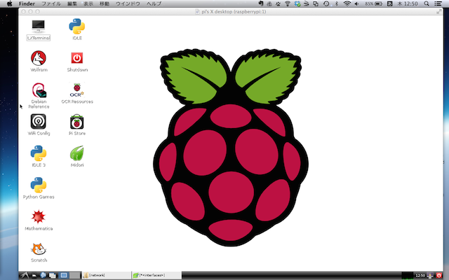

# Raspberry Piと
# Arduinoで
# IoT

---
## 自己紹介

　植田達郎（@weed_7777）

- フリーランス
    - JavaScript
    - Objective-C
- 趣味
    - 自転車
    - 城巡り

---
## Raspberry Piのセットアップ


## OS


[RaspberryPi - Raspberry Pi に入門してみた。 - Qiita](http://qiita.com/tomk79/items/cdc1b88358afba2c6337)

---
## VNCサーバ

Wifi configを使うため




---

[Raspbbery Pi Model B+ セットアップ](http://qiita.com/jh3rox/items/684ba1e746a6a3763b5c)

VNCサーバの起動

[はじめてのHubot - Qiita](http://qiita.com/kmdsbng/items/fdc069048b5f0d07295e)

基本的なHubotコマンド

[hubot-twitter-userstreamをリリースしました - 意識の高いコード](http://hoo89.hatenablog.com/entry/2014/08/08/180202)

[RaspberryPi - Raspberry Pi に入門してみた。 - Qiita](http://qiita.com/tomk79/items/cdc1b88358afba2c6337)

容量の増やし方
```
$ sudo raspi-config
```

[Raspberry PiでNode.jsを動かす - Qiita](http://qiita.com/tomo_watanabe/items/3f1810bf7e721cf9dfd2)

Node.jsのコンパイル

[MacでRaspberry PiにNode.jsをインストールする - yutaponのブログ](http://yutapon.hatenablog.com/entry/2013/12/21/013231)

Node.jsの初期化を自動化する